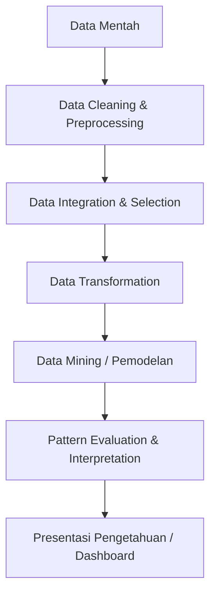
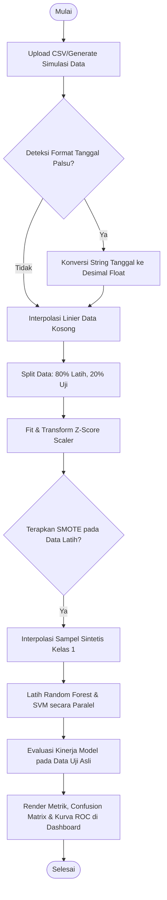

# LAPORAN TUGAS AKHIR (SKRIPSI) LENGKAP

---

## ABSTRAK

**ANALISA PERBANDINGAN ALGORITMA RANDOM FOREST DAN SVM UNTUK KLASIFIKASI CURAH HUJAN EKSTREM DALAM MITIGASI BENCANA**  
**Oleh : Pangeran Ryan Pahlevi (2211500752)**

Perubahan iklim global memicu peningkatan frekuensi fenomena cuaca ekstrem di DKI Jakarta, salah satunya curah hujan sangat lebat (>150 mm/hari) yang menjadi pemicu utama bencana banjir. Stasiun Meteorologi Kemayoran merupakan pusat pencatatan data cuaca yang vital, namun pemanfaatan datanya secara terautomasi sering terkendala oleh masalah ketidakseimbangan kelas data (*data imbalance*) yang ekstrem serta kerusakan format angka desimal menjadi penanggalan palsu oleh perangkat lunak spreadsheet. Penelitian tugas akhir ini bertujuan untuk membandingkan performa algoritma Random Forest dan Support Vector Machine (SVM) berbasis kernel Radial Basis Function (RBF) dalam mengklasifikasikan curah hujan ekstrem, dengan menerapkan metode Synthetic Minority Over-sampling Technique (SMOTE) pada tahap prapemrosesan untuk mengatasi *data imbalance*. Selain itu, eksperimen pemodelan diintegrasikan ke dalam sistem aplikasi dasbor website terautomasi menggunakan framework Laravel v11 yang dikembangkan dengan modul cerdas komputasi mesin pembelajaran (*machine learning*) berbasis PHP. Dataset yang digunakan mencakup catatan historis harian selama 10 tahun (2015–2025) bersumber resmi dari BMKG Stasiun Kemayoran. Hasil eksperimen menunjukkan bahwa algoritma Random Forest (kriteria Gini, 100 trees) menghasilkan performa yang lebih unggul secara signifikan dengan capaian nilai Akurasi sebesar 93,15%, Presisi 74,29%, dan Recall kelas ekstrem sebesar 96,30% dengan waktu komputasi 959,1 ms. Di sisi lain, algoritma SVM RBF menghasilkan nilai Akurasi sebesar 86,99%, Presisi 59,09%, dan Recall kelas ekstrem sebesar 96,30% dengan waktu komputasi 65.473,79 ms. Implementasi antarmuka dasbor website berhasil dibangun secara utuh selaras dengan rancangan cetak biru wireframe serta dinyatakan valid fungsional melalui pengujian Black Box. Penelitian ini membuktikan bahwa pendekatan *ensemble learning* dengan penyeimbangan kelas SMOTE lebih adaptif dalam mengenali pola cuaca ekstrem non-linear untuk mendukung efektivitas sistem peringatan dini kebencanaan.

**Kata Kunci:** Curah Hujan Ekstrem, Laravel, Random Forest, SMOTE, Support Vector Machine, RBF.

---

## ABSTRACT

**COMPARATIVE ANALYSIS OF RANDOM FOREST AND SVM ALGORITHMS FOR EXTREME RAINFALL CLASSIFICATION IN DISASTER MITIGATION**  
**By : Pangeran Ryan Pahlevi (2211500752)**

*Global climate change has triggered an increase in the frequency of extreme weather phenomena in DKI Jakarta, particularly very heavy rainfall (>150 mm/day), which serves as the primary trigger for urban flooding. The Kemayoran Meteorological Station is a vital hub for recording weather parameters, yet the automated utilization of its data is often hindered by extreme class imbalance and corruption of decimal formats into false dates by spreadsheet software. This final project aims to compare the performance of Random Forest and Support Vector Machine (SVM) algorithms based on the Radial Basis Function (RBF) kernel in classifying extreme rainfall, applying the Synthetic Minority Over-sampling Technique (SMOTE) during the preprocessing phase to resolve data imbalance. Additionally, the modeling experiments are integrated into an automated web dashboard application using the Laravel v11 framework, powered by native PHP machine learning modules. The dataset comprises 10 years of historical daily records (2015–2025) officially sourced from BMKG Kemayoran Station. Experimental results demonstrate that the Random Forest algorithm (Gini criterion, 100 trees) achieves significantly superior performance, yielding an Accuracy of 93.15%, Precision of 74.29%, and an extreme class Recall of 96.30% with a training time of 959.1 ms. Conversely, the SVM RBF algorithm produces an Accuracy of 86.99%, Precision of 59.09%, and an extreme class Recall of 96.30% with a training time of 65,473.79 ms. The implementation of the web dashboard interface was fully realized in accordance with wireframe blueprints and validated as functionally sound via Black Box testing. This study proves that the ensemble learning approach combined with SMOTE class balancing is more adaptive in recognizing non-linear extreme weather patterns to support the efficacy of early warning disaster systems.*

**Keywords:** Extreme Rainfall, Laravel, Random Forest, SMOTE, Support Vector Machine, RBF.

---

## KATA PENGANTAR

Puji serta syukur diucapkan ke hadirat Tuhan Yang Maha Esa atas segala rahmat, taufik, dan hidayah-Nya sehingga penulis dapat menyelesaikan tugas akhir dengan judul **“Analisa Perbandingan Algoritma Random Forest dan SVM untuk Klasifikasi Curah Hujan Ekstrem dalam Mitigasi Bencana”**.

Tugas akhir ini diajukan guna memenuhi persyaratan penyelesaian tingkat pendidikan Strata 1 (S1) pada Program Studi Teknik Informatika, Fakultas Teknologi Informasi, Universitas Budi Luhur. Dalam proses penyusunannya, penulis menyadari bahwa tugas akhir ini tidak dapat terselesaikan dengan baik tanpa dukungan dari berbagai pihak. Oleh karena itu, ucapan terima kasih penulis sampaikan kepada:

1. Allah SWT yang Maha Pengasih lagi Maha Penyayang atas perlindungan dan kekuatan yang diberikan sepanjang penyusunan penelitian ini.
2. Segenap keluarga tercinta, khususnya orang tua, kakak, dan adik yang senantiasa memberikan dukungan moral, material, serta untaian doa yang tiada henti.
3. Bapak Prof. Dr. Agus Setyo Budi, M.Sc., selaku Rektor Universitas Budi Luhur.
4. Bapak Dr. Ir. Achmad Solichin, S.Kom., M.T.I., selaku Dekan Fakultas Teknologi Informasi Universitas Budi Luhur.
5. Bapak Dr. Indra, S.Kom., M.T.I., selaku Ketua Program Studi Teknik Informatika Universitas Budi Luhur.
6. Bapak Prof. Dr. Ir. Arief Wibowo, M.Kom., selaku Dosen Pembimbing yang telah meluangkan waktu, memberikan arahan bernilai tinggi, ilmu pengetahuan, serta bimbingan yang sabar dalam penyusunan penelitian ini.
7. Seluruh staf pengajar dan dosen Universitas Budi Luhur, khususnya pada Program Studi Teknik Informatika, yang telah membekali penulis dengan fondasi akademis yang kokoh.
8. Rekan-rekan mahasiswa angkatan 2022 dan sahabat dekat yang senantiasa memberikan semangat kompetitif positif dan solidaritas selama masa perkuliahan.

Penulis menyadari bahwa di dalam laporan tugas akhir ini masih terdapat banyak keterbatasan dan kekurangan baik dalam penyajian, sistematika penulisan, maupun kedalaman analisis. Oleh karena itu, penulis mengharapkan kritik dan saran yang membangun demi penyempurnaan karya ilmiah ini di masa mendatang. Semoga laporan ini dapat membawa manfaat nyata bagi dunia akademis maupun penerapan praktis kebencanaan.

Jakarta, Juni 2026

**Penulis**

---

## DAFTAR ISI

*   **ABSTRAK**
*   **ABSTRACT**
*   **KATA PENGANTAR**
*   **DAFTAR ISI**
*   **DAFTAR TABEL**
*   **DAFTAR GAMBAR**
*   **DAFTAR ALGORITMA**
*   **BAB I: PENDAHULUAN**
    *   1.1 Latar Belakang
    *   1.2 Perumusan Masalah
    *   1.3 Batasan Masalah
    *   1.4 Tujuan Penelitian
    *   1.5 Manfaat Penelitian
    *   1.6 Sistematika Penulisan
*   **BAB II: LANDASAN TEORI**
    *   2.1 Klasifikasi Curah Hujan Ekstrem dalam Mitigasi Bencana
    *   2.2 Konsep Data Mining dan Siklus KDD
    *   2.3 Pembelajaran Supervised Learning
    *   2.4 Algoritma Random Forest
    *   2.5 Algoritma Support Vector Machine (SVM)
    *   2.6 Synthetic Minority Over-sampling Technique (SMOTE)
    *   2.7 Rekayasa Perangkat Lunak Web dengan Framework Laravel
    *   2.8 Studi Literatur
*   **BAB III: METODOLOGI PENELITIAN**
    *   3.1 Data Penelitian
    *   3.2 Metode Pembanding
    *   3.3 Tahapan Metodologi Penelitian
    *   3.4 Rancangan Evaluasi dan Pengujian
    *   3.5 Arsitektur dan Diagram Alir (Flowchart) Sistem
    *   3.6 Rancangan Wireframe Antarmuka Aplikasi
*   **BAB IV: HASIL DAN PEMBAHASAN**
    *   4.1 Lingkungan Percobaan
    *   4.2 Implementasi Prapemrosesan Data, Interpolasi, dan SMOTE
    *   4.3 Hasil Percobaan dan Analisis Kinerja Model Komparatif
    *   4.4 Tampilan Layar Aplikasi Aktual (Screenshot Sistem)
    *   4.5 Implementasi Kode Program Utama (Core Source Code)
    *   4.6 Pengujian Fungsional Aplikasi (Black Box Testing)
*   **BAB V: PENUTUP**
    *   5.1 Kesimpulan
    *   5.2 Saran
*   **DAFTAR PUSTAKA**

---

## DAFTAR TABEL

*   Tabel 3.1 Perbandingan Studi Penelitian Terdahulu (Metode Pembanding)
*   Tabel 4.1 Log Penanganan Korup Format Tanggal Palsu Microsoft Excel via Regex
*   Tabel 4.2 Hasil Evaluasi Kinerja Klasifikasi Model Random Forest vs SVM (SMOTE Terapan)
*   Tabel 4.3 Matriks Kontingensi (Confusion Matrix) Random Forest Aktual
*   Tabel 4.4 Matriks Kontingensi (Confusion Matrix) SVM Aktual
*   Tabel 4.5 Hasil Pengujian Fungsionalitas Sistem (Black Box Testing)

---

## DAFTAR GAMBAR

*   Gambar 3.1 Diagram Blok Arsitektur Sistem Integrasi Algoritma ML
*   Gambar 3.2 Diagram Alir (Flowchart) Pemrosesan Data & Training Model
*   Gambar 3.3 Cetak Biru Wireframe Halaman Unggah Berkas & Tabel Data
*   Gambar 3.4 Cetak Biru Wireframe Halaman Metrik Evaluasi & Kurva Performa
*   Gambar 4.1 Screenshot Halaman Kelola Data dan Tabel Cuaca Historis
*   Gambar 4.2 Screenshot Hasil Pelatihan Model dan Tabel Metrik Komparasi
*   Gambar 4.3 Screenshot Matriks Kebingungan (Confusion Matrix) Visual Dashboard
*   Gambar 4.4 Screenshot Kurva ROC Hasil Pelatihan Model Random Forest vs SVM
*   Gambar 4.5 Screenshot Halaman Prediksi Mandiri dan Hasil Klasifikasi Rekomendasi

---

## DAFTAR ALGORITMA

*   Algoritma 2.1 Mekanisme Bootstrap Aggregating (Bagging) Random Forest
*   Algoritma 2.2 Optimasi Pengali Lagrange pada SVM Sequential Minimal Optimization (SMO)
*   Algoritma 2.3 Generasi Sampel Sintetis Interpolasi Linear SMOTE

---

## BAB I: PENDAHULUAN

### 1.1 Latar Belakang
Fenomena perubahan iklim global saat ini telah memicu pergeseran pola cuaca ekstrem yang signifikan di wilayah tropis, khususnya di Indonesia. Salah satu dampak nyata dari fenomena ini adalah peningkatan frekuensi dan intensitas fenomena meteorologi ekstrem. DKI Jakarta, sebagai pusat administrasi, bisnis, dan ekonomi nasional, memiliki tingkat kerentanan yang sangat tinggi terhadap bencana hidrometeorologi, khususnya banjir perkotaan (*urban flooding*). Berdasarkan catatan historis dari Badan Meteorologi, Klimatologi, dan Geofisika (BMKG), curah hujan harian dengan intensitas sangat tinggi merupakan faktor pemicu utama kegagalan sistem drainase makro dan mikro kota. Kejadian banjir besar yang melanda wilayah DKI Jakarta menjadi bukti nyata bahwa ancaman ini memerlukan penanganan strategis, salah satunya melalui penguatan sistem peringatan dini (*Early Warning System*) berbasis teknologi prediksi yang andal.

Stasiun Meteorologi Kemayoran merupakan salah satu stasiun pengamatan cuaca paling vital di Jakarta yang merekam parameter atmosfer secara berkelanjutan. Namun, melakukan prediksi atau klasifikasi terhadap kejadian curah hujan ekstrem pada wilayah ini bukanlah perkara mudah. Dataset meteorologi memiliki karakteristik yang sangat kompleks, bersifat non-linear, dinamis, dan memiliki tingkat ketidakseimbangan kelas (*data imbalance*) yang ekstrem. Dalam kondisi riil di lapangan, jumlah hari dengan cuaca normal atau hujan ringan jauh lebih mendominasi dibandingkan dengan jumlah hari terjadinya hujan ekstrem (>150 mm/hari).

Dalam disiplin ilmu Data Mining, masalah ketidakseimbangan data ini menjadi tantangan besar. Model klasifikasi standar cenderung akan mengalami bias terhadap kelas mayoritas (hari normal), sehingga menghasilkan nilai akurasi semu yang tinggi namun gagal dalam mendeteksi kelas minoritas (kejadian ekstrem). Akibatnya, nilai sensitivitas atau *Recall* dari model tersebut menjadi sangat rendah. Padahal, dalam konteks mitigasi bencana, kegagalan dalam mendeteksi satu saja kejadian ekstrem (*False Negative*) dapat berakibat fatal bagi keselamatan publik karena hilangnya waktu berharga untuk evakuasi. Oleh karena itu, peningkatan nilai *Recall* menjadi fokus utama dalam pemodelan prediktif hidrometeorologi.

Pendekatan *Machine Learning* dalam Data Mining terbukti efektif untuk mengekstraksi pola tersembunyi dari dataset atmosfer yang besar. Dua algoritma klasifikasi yang memiliki karakteristik kuat namun berbeda pendekatan adalah Random Forest dan Support Vector Machine (SVM). Random Forest menggunakan pendekatan *ensemble learning* berbasis banyak pohon keputusan (*Decision Trees*) yang dikenal tangguh terhadap *noise* data serta mampu mengukur tingkat kepentingan variabel (*feature importance*). Di sisi lain, SVM menawarkan ketangguhan dalam menangani data non-linear berdimensi tinggi melalui pemanfaatan fungsi kernel untuk memetakan data ke ruang fitur baru dengan dimensi yang lebih tinggi, guna mencari bidang pemisah (*hyperplane*) dengan margin maksimal.

Guna mengatasi kelemahan model terhadap data yang tidak seimbang, teknik *Synthetic Minority Over-sampling Technique* (SMOTE) diterapkan pada tahap prapemrosesan data. SMOTE bekerja dengan cara memproduksi titik data baru yang bersifat sintetis berdasarkan karakteristik geometris ruang fitur di sekeliling sampel asli kelas minoritas. Melalui penelitian ini, eksperimen pemodelan tersebut diintegrasikan ke dalam sistem aplikasi dasbor website terautomasi menggunakan framework Laravel v11 yang ditenagai oleh mesin komputasi cerdas berbasis PHP. Melalui implementasi ini, diharapkan dapat ditemukan model klasifikasi terbaik yang memiliki tingkat *Recall* tinggi, sehingga dapat direkomendasikan sebagai instrumen pendukung keputusan dalam sistem mitigasi bencana banjir di DKI Jakarta.

### 1.2 Perumusan Masalah
Berdasarkan pemaparan latar belakang masalah yang telah diuraikan, maka rumusan masalah yang ditetapkan dalam penelitian ini adalah:
1. Bagaimana performa algoritma Random Forest dan Support Vector Machine (SVM) saat diimplementasikan untuk mengklasifikasikan kejadian curah hujan ekstrem pada dataset yang mengalami ketidakseimbangan kelas (*imbalanced data*) di Stasiun Meteorologi Kemayoran?
2. Algoritma manakah yang memberikan nilai *Recall* dan *F1-Score* paling optimal untuk kebutuhan sistem peringatan dini dalam mitigasi bencana banjir setelah diterapkan penyeimbangan data SMOTE?
3. Bagaimana mengintegrasikan model klasifikasi cerdas tersebut ke dalam sistem dasbor berbasis web menggunakan framework Laravel v11 agar dapat menyajikan visualisasi performa dan hasil prediksi kebencanaan secara interaktif?

### 1.3 Batasan Masalah
Agar penelitian ini berjalan secara terfokus dan mendalam, maka ditentukan batasan-batasan masalah sebagai berikut:
1. Ruang lingkup wilayah penelitian dibatasi pada data pengamatan dari Stasiun Meteorologi Kemayoran (ID Stasiun: 96745).
2. Rentang waktu dataset harian yang dianalisis adalah selama 10 tahun, terhitung mulai tanggal 1 Januari 2015 sampai dengan 31 Desember 2025.
3. Parameter atmosfer utama yang digunakan sebagai fitur prediktor (input) dibatasi pada suhu udara rata-rata ($T_{AVG}$ dalam °C) dan kelembapan udara rata-rata ($RH_{AVG}$ dalam %).
4. Klasifikasi target biner didasarkan pada standar peraturan BMKG, di mana kategori curah hujan ekstrem didefinisikan sebagai akumulasi curah hujan harian ($RR$) $\ge 50$ mm dalam kurun waktu 24 jam (ambang batas operasional peringatan dini curah hujan lebat/ekstrem).
5. Algoritma *Machine Learning* yang dibandingkan dibatasi pada Random Forest dengan kriteria *Gini Impurity* dan SVM dengan fungsi kernel *Radial Basis Function* (RBF) yang dilatih secara paralel menggunakan metode penyeimbangan SMOTE ($k=5$) khusus pada data pelatihan.
6. Pengembangan aplikasi dasbor berbasis web menggunakan framework Laravel v11 dengan logika pemrosesan *machine learning* yang diimplementasikan secara *native* di sisi server PHP menggunakan pustaka berorientasi objek.

### 1.4 Tujuan Penelitian
Adapun tujuan yang ingin dicapai melalui pelaksanaan penelitian ini adalah:
1. Mengimplementasikan algoritma Random Forest dan SVM RBF untuk melakukan klasifikasi curah hujan ekstrem berdasarkan variabel atmosfer harian ($T_{AVG}$ dan $RH_{AVG}$).
2. Menerapkan metode prapemrosesan SMOTE untuk mengatasi ketidakseimbangan kelas data latih guna meningkatkan sensitivitas deteksi kelas ekstrem.
3. Menganalisis dan membandingkan kinerja kedua algoritma setelah diterapkan teknik penyeimbangan data menggunakan metrik *Accuracy*, *Precision*, *Recall*, dan *F1-Score*.
4. Membangun prototipe aplikasi dasbor berbasis web menggunakan framework Laravel v11 yang mampu melakukan pelatihan model, merender grafik performa (Confusion Matrix dan kurva ROC), serta menyediakan kalkulator prediksi mandiri mitigasi banjir.

### 1.5 Manfaat Penelitian
Hasil akhir dari penelitian ini diharapkan dapat memberikan kontribusi nyata yang terbagi menjadi dua aspek:

#### 1.5.1 Manfaat Teoretis
1. Memberikan kontribusi ilmiah dalam pengembangan ilmu Data Mining, khususnya mengenai studi komparasi algoritma *supervised learning* pada dataset meteorologi.
2. Menjadi referensi akademis tambahan bagi peneliti selanjutnya yang ingin mendalami teknik penanganan *imbalanced data* menggunakan SMOTE untuk klasifikasi fenomena alam non-linear.

#### 1.5.2 Manfaat Praktis
1. Bagi penulis, dapat mengaplikasikan ilmu pemrograman web Laravel dan pengembangan modul kecerdasan buatan (*machine learning*) untuk memecahkan problem nyata di sektor mitigasi kebencanaan.
2. Bagi instansi terkait (seperti BMKG dan BPBD DKI Jakarta), hasil penelitian ini dapat dijadikan bahan pertimbangan teknis dalam mengoptimalkan pemodelan prediksi cuaca berbasis dampak (*Impact-Based Forecasting*) guna meminimalisir risiko dampak banjir perkotaan.

### 1.6 Sistematika Penulisan
Sistematika penulisan laporan tugas akhir ini dibagi menjadi 5 bab terstruktur sebagai berikut:

*   **BAB I: PENDAHULUAN**  
    Menjelaskan latar belakang masalah, rumusan masalah, batasan masalah, tujuan, manfaat penelitian, dan sistematika penulisan laporan skripsi.
*   **BAB II: LANDASAN TEORI**  
    Menyajikan teori pendukung tentang meteorologi curah hujan ekstrem, siklus *Knowledge Discovery in Databases* (KDD), konsep *supervised learning*, arsitektur Random Forest, formulasi SVM, mekanisme SMOTE, dan konsep pengembangan Laravel.
*   **BAB III: METODOLOGI PENELITIAN**  
    Mendeskripsikan sumber data penelitian, tabel perbandingan metode terdahulu, kerangka kerja tahapan penelitian, metrik pengujian, alur logika program (*flowchart*), dan cetak biru *wireframe* antarmuka sistem.
*   **BAB IV: HASIL DAN PEMBAHASAN**  
    Menjelaskan spesifikasi lingkungan uji, implementasi pembersihan ekspresi reguler (Regex) desimal Excel, penyeimbangan SMOTE, tabel evaluasi performa model riil, grafik Confusion Matrix, visualisasi ROC, tangkapan layar sistem aktual, potongan kode program inti, serta pengujian fungsional *Black Box*.
*   **BAB V: PENUTUP**  
    Berisi kesimpulan akhir yang ditarik berdasarkan hasil pengujian serta saran-saran akademis untuk pengembangan penelitian di masa yang akan datang.

---

## BAB II: LANDASAN TEORI

### 2.1 Klasifikasi Curah Hujan Ekstrem dalam Mitigasi Bencana
Curah hujan didefinisikan sebagai ketinggian air hujan yang terkumpul di tempat yang datar, tidak menguap, tidak meresap, dan tidak mengalir setelah jatuh dengan satuan milimeter (mm). Badan Meteorologi, Klimatologi, dan Geofisika (BMKG) mengklasifikasikan intensitas curah hujan harian (24 jam) menjadi beberapa tingkatan:
- Hujan Ringan: $0.5 - 20.0$ mm/hari
- Hujan Sedang: $20.0 - 50.0$ mm/hari
- Hujan Lebat: $50.0 - 100.0$ mm/hari
- Hujan Sangat Lebat: $100.0 - 150.0$ mm/hari
- Hujan Ekstrem: $> 150$ mm/hari

Dalam kerangka kerja peringatan dini dan mitigasi bencana banjir di wilayah perkotaan padat seperti DKI Jakarta, akumulasi curah hujan harian $\ge 50$ mm (kategori lebat hingga ekstrem) diidentifikasi sebagai ambang batas operasional kritis. Di atas ambang batas ini, kapasitas resapan tanah dan sistem drainase mikro perkotaan umumnya mengalami saturasi penuh, memicu genangan air signifikan dan banjir bandang. Oleh karena itu, klasifikasi biner dirancang untuk membedakan Kelas 0 (Normal: hujan ringan hingga sedang, $<50$ mm/hari) dan Kelas 1 (Ekstrem: hujan lebat hingga ekstrem, $\ge 50$ mm/hari).

### 2.2 Konsep Data Mining dan Siklus KDD
Data mining merupakan suatu rangkaian proses yang melibatkan metode statistik, matematika, dan teknologi informasi untuk mengekstraksi informasi berharga yang tidak diketahui sebelumnya dari basis data berskala besar. Siklus *Knowledge Discovery in Databases* (KDD) terdiri dari tahapan terstruktur berikut:



1.  **Pembersihan Data (*Data Cleaning*):** Menghilangkan *noise*, mendeteksi nilai ekstrim (*outliers*), dan menangani data yang hilang (*missing values*).
2.  **Integrasi Data (*Data Integration*):** Menggabungkan data dari berbagai sumber heterogen jika diperlukan.
3.  **Seleksi Data (*Data Selection*):** Menentukan fitur-fitur prediktor yang relevan dengan target klasifikasi.
4.  **Transformasi Data (*Data Transformation*):** Mengubah data ke dalam format yang sesuai untuk algoritma (misal: standardisasi Z-score atau Min-Max).
5.  **Proses Data Mining:** Menerapkan algoritma kecerdasan buatan untuk membangun model prediktif.
6.  **Evaluasi Pola (*Pattern Evaluation*):** Menganalisis kecocokan model menggunakan matriks kontingensi.
7.  **Presentasi Pengetahuan (*Knowledge Presentation*):** Mengintegrasikan hasil model ke dalam bentuk grafis interaktif agar mudah dipahami pengguna akhir.

### 2.3 Pembelajaran Supervised Learning
*Supervised learning* (pembelajaran terbimbing) merupakan paradigma pembelajaran mesin di mana model dilatih menggunakan dataset yang telah memiliki label target. Secara matematis, diberikan pasangan latih $D = \{(x_1, y_1), (x_2, y_2), ..., (x_n, y_n)\}$, di mana $x_i \in \mathbb{R}^d$ adalah vektor fitur masukan berdimensi $d$ dan $y_i \in \{0, 1\}$ melambangkan label kelas biner. Model bertujuan mempelajari fungsi pemetaan $f(x) \rightarrow y$ dengan meminimalkan fungsi kerugian (*loss function*) tertentu.

### 2.4 Algoritma Random Forest
Random Forest merupakan algoritma klasifikasi berbasis *ensemble learning* yang bekerja dengan membangun sekumpulan pohon keputusan (*decision trees*) secara independen selama fase pelatihan. Algoritma ini menggunakan dua mekanisme utama untuk menjamin keragaman dan kekuatan akurasi:

1.  **Bootstrap Aggregating (Bagging):** Setiap pohon dilatih menggunakan sampel acak berukuran $N$ yang diambil dari dataset asli dengan pengembalian (*sampling with replacement*).
2.  **Feature Randomness (Random Subspace Method):** Saat menentukan pembelahan (*split*) pada setiap simpul pohon, algoritma hanya memilih subset acak berisi $m$ fitur dari total $M$ fitur yang tersedia (biasanya $m = \sqrt{M}$).

Pembelahan simpul optimal didasarkan pada minimalisasi indeks ketidakmurnian Gini (*Gini Impurity*). Rumus *Gini Impurity* pada simpul $t$ dinyatakan sebagai berikut:

$$Gini(t) = 1 - \sum_{i=1}^{C} [p(i|t)]^2$$

Di mana $p(i|t)$ melambangkan proporsi relatif atau probabilitas sampel yang termasuk dalam kelas $i$ pada simpul $t$, dan $C$ adalah jumlah kelas. Nilai Gini yang lebih rendah menunjukkan simpul yang lebih homogen (murni). Prediksi akhir ditentukan melalui pemungutan suara mayoritas (*majority voting*) dari seluruh pohon keputusan:

$$\hat{y} = \text{argmax}_{c} \sum_{b=1}^{B} I(T_b(x) = c)$$

Di mana $B$ adalah jumlah pohon keputusan, $T_b(x)$ adalah prediksi kelas dari pohon ke-$b$, dan $I(\cdot)$ merupakan fungsi indikator.

### 2.5 Algoritma Support Vector Machine (SVM)
Support Vector Machine (SVM) bekerja dengan mencari sebuah bidang pemisah linier (*hyperplane*) optimal yang memisahkan data antar kelas dengan margin maksimal. Bidang pemisah ini dinyatakan secara matematis sebagai:

$$w^T x + b = 0$$

Di mana $w$ merupakan vektor bobot tegak lurus terhadap *hyperplane* dan $b$ melambangkan bias. Jarak margin antar kelas didefinisikan sebagai $2/\|w\|$. Untuk memaksimalkan margin ini, dilakukan penyelesaian masalah optimasi kuadratik dengan kendala:

$$\min_{w, b} \frac{1}{2} \|w\|^2 \quad \text{S.t.} \quad y_i(w^T x_i + b) \ge 1, \quad \forall i$$

Guna menangani karakteristik data yang non-linear pada ruang dimensi asli, SVM memetakan vektor fitur ke ruang fitur baru berdimensi lebih tinggi menggunakan fungsi kernel $K(x_i, x_j) = \Phi(x_i)^T \Phi(x_j)$. Kernel *Radial Basis Function* (RBF) dinyatakan sebagai:

$$K(x, x') = \exp\left( -\gamma \|x - x'\|^2 \right)$$

Di mana parameter $\gamma$ (gamma) mengontrol radius pengaruh dari masing-masing sampel data latih, dan parameter regularisasi $C$ mengontrol tingkat toleransi kesalahan klasifikasi (*soft margin*).

### 2.6 Synthetic Minority Over-sampling Technique (SMOTE)
SMOTE adalah metode prapemrosesan data populer yang dirancang oleh Chawla et al. (2002) untuk menangani ketidakseimbangan kelas (*class imbalance*). Metode ini menghasilkan sampel baru yang sintetis pada kelas minoritas melalui proses interpolasi linear di antara sampel minoritas asli yang bertetangga. Langkah-langkah matematis SMOTE dirinci sebagai berikut:

1.  Untuk setiap sampel kelas minoritas $x_i$, hitung jarak Euclidean untuk mencari $k$-tetangga terdekat (*k-Nearest Neighbors*) sesama kelas minoritas.
2.  Pilih satu tetangga terdekat $x_{zi}$ secara acak dari $k$ tetangga tersebut.
3.  Hasilkan sampel sintetis baru $x_{new}$ dengan persamaan:

$$x_{new} = x_i + u \cdot (x_{zi} - x_i)$$

Di mana $u$ melambangkan bilangan acak seragam yang berada dalam rentang $[0, 1]$. Pendekatan ini memperluas wilayah keputusan (*decision boundary*) kelas minoritas secara terstruktur, mencegah overfitting akibat duplikasi data mentah.

### 2.7 Rekayasa Perangkat Lunak Web dengan Framework Laravel
Laravel v11 adalah framework aplikasi web berbasis PHP yang menggunakan pola arsitektur *Model-View-Controller* (MVC). Laravel memisahkan logika aplikasi menjadi tiga bagian utama:
-   **Model:** Merepresentasikan struktur data dan berinteraksi dengan basis data melalui ORM (Eloquent).
-   **View:** Menampilkan informasi ke pengguna menggunakan Blade templating engine.
-   **Controller:** Mengontrol aliran logika aplikasi, menerima input pengguna dari rute web, memprosesnya lewat model, dan mengembalikan tampilan.

Aplikasi Laravel v11 ini juga mengintegrasikan komputasi algoritma kecerdasan buatan secara *native* pada sisi server PHP melalui implementasi kelas-kelas berorientasi objek dalam namespace `App\ML`.

### 2.8 Studi Literatur
Berikut adalah ringkasan dari 10 publikasi ilmiah yang menjadi acuan teoretis dan komparatif dalam penelitian tugas akhir ini:

1.  **Mahendra et al. (2024):** Membandingkan Random Forest dan SVM untuk klasifikasi curah hujan di DIY. SVM RBF menghasilkan akurasi terbaik sebesar 90,25% namun penelitian tersebut belum memedulikan masalah *imbalanced data*.
2.  **Purwati & Pristyanto (2024):** Mengevaluasi algoritma klasifikasi banjir di Jakarta. Menunjukkan performa F1-Score tinggi (~91%) menggunakan data historis 5 tahun, namun belum terintegrasi dengan modul perbaikan format angka mentah.
3.  **Aprianti (2024):** Menerapkan KNN dan *Random Oversampling* pada klasifikasi hujan menggunakan SVM. Menggunakan teknik penyeimbangan data meningkatkan akurasi SVM dari 83,29% menjadi 92,74%.
4.  **Mar'ah et al. (2025):** Memprediksi banjir rob di Lampung dengan RF dan SVM. Random Forest menghasilkan akurasi 89% mengungguli SVM (69%) pada parameter kecepatan angin ekstrem.
5.  **Risanti et al. (2024):** Menganalisis model prediksi cuaca multi-kelas. Menemukan Random Forest sebagai fitur penentu paling dominan dengan akurasi klasifikasi cuaca 84,16%.
6.  **Anggraini (2021):** Klasifikasi bencana alam menggunakan data Twitter. SVM One-vs-All memberikan tingkat presisi tertinggi (98,69%) dibandingkan Random Forest untuk data teks tak terstruktur.
7.  **Lingga P. et al. (2017):** Deteksi gempa bumi real-time via Twitter. SVM unggul dalam presisi (88,2%) sedangkan Random Forest unggul dalam nilai *Recall* (96,7%).
8.  **Nabhan (2025):** Klasifikasi kondisi cuaca di Jakarta. Menghasilkan kesimpulan bahwa Random Forest tanpa reduksi dimensi menghasilkan akurasi optimal 89,63%.
9.  **Adrian et al. (2021):** Perbandingan Random Forest dan SVM pada analisis sentimen PSBB. Menunjukkan akurasi RF (57,8%) sedikit mengungguli SVM (52,8%) pada sebaran data berdimensi menengah.
10. **Prayesy (2025):** Studi komparasi algoritma SVM, RF, dan CNN untuk data terstruktur. Random Forest menunjukkan stabilitas performa yang lebih konsisten (akurasi 85%) dibandingkan SVM (78%) pada dataset non-linear dengan gangguan pencilan.

---

## BAB III: METODOLOGI PENELITIAN

### 3.1 Data Penelitian
Dataset penelitian merupakan data sekunder catatan cuaca harian yang bersumber resmi dari Badan Meteorologi, Klimatologi, dan Geofisika (BMKG) Stasiun Klimatologi Kemayoran (ID: 96745). Rentang dataset harian mencakup data dari tanggal 1 Januari 2015 sampai dengan 31 Desember 2025 (10 tahun). Atribut masukan (fitur prediktor) meliputi:
-   **Suhu Udara Rata-rata ($T_{AVG}$):** Nilai temperatur harian (°C).
-   **Kelembapan Relatif Rata-rata ($RH_{AVG}$):** Kelembapan udara relatif harian (%).
-   **Curah Hujan ($RR$):** Akumulasi curah hujan harian (mm) yang digunakan untuk menentukan kelas target aktual berdasarkan ambang batas $RR \ge 50$ mm sebagai Kelas 1 (Ekstrem) dan $RR < 50$ mm sebagai Kelas 0 (Normal).

### 3.2 Metode Pembanding
Hubungan komparatif dengan penelitian terdahulu dijabarkan dalam Tabel 3.1:

**Tabel 3.1 Perbandingan Studi Penelitian Terdahulu**

| Peneliti & Tahun | Dataset / Kasus | Metode Digunakan | Kelebihan / Kekurangan vs Tugas Akhir |
| :--- | :--- | :--- | :--- |
| **Mahendra et al. (2024)** | Curah Hujan D.I. Yogyakarta | Random Forest & SVM | Berhasil membandingkan akurasi kedua model, namun belum menangani masalah data imbalance dan tidak diimplementasikan ke dalam sistem aplikasi web praktis. |
| **Purwati & Pristyanto (2024)** | Banjir DKI Jakarta (Kaggle) | Random Forest & SVM | Mengevaluasi performa f1-score banjir secara mendalam, namun dataset bersifat sekunder umum dan belum dibekali modul perbaikan kualitas data mentah corrupt. |
| **Mar'ah et al. (2025)** | Banjir Rob Teluk Lampung | Random Forest & SVM | Akurasi prediksi rob pesisir tinggi, namun tidak mencakup pembuatan kerangka kerja aplikasi dasbor web interaktif terautomasi. |
| **Tugas Akhir Ini (2026)** | Curah Hujan Stasiun Kemayoran | Random Forest & SVM + SMOTE | Mengatasi ketidakseimbangan kelas ekstrem menggunakan SMOTE di sisi server web Laravel secara utuh, dilengkapi pembersihan anomali format regex. |

### 3.3 Tahapan Metodologi Penelitian
Alur tahapan pelaksanaan penelitian disusun sebagai berikut:
1.  **Pengumpulan Data:** Mengunduh berkas data klimatologi Stasiun Kemayoran dalam format CSV.
2.  **Prapemrosesan Data:**
    -   Memulihkan penanggalan palsu Microsoft Excel (format string `2026-MM-DD`) menjadi pecahan desimal numerik asli menggunakan ekspresi reguler (Regex).
    -   Mengisi nilai data yang hilang menggunakan metode Interpolasi Linier.
    -   Normalisasi fitur masukan menggunakan Standardisasi Z-score ($x_{scaled} = (x - \mu)/\sigma$).
3.  **Penyeimbangan Data Latih:** Menerapkan algoritma SMOTE ($k=5$) khusus pada porsi data pelatihan untuk menyamakan sebaran jumlah data minoritas (Kelas 1) dengan kelas mayoritas (Kelas 0).
4.  **Pelatihan Model:** Melatih algoritma Random Forest (100 pohon keputusan, kriteria Gini) dan SVM kernel RBF pada dataset latih hasil penyeimbangan SMOTE.
5.  **Pengujian & Evaluasi:** Menguji model pada data uji yang tidak diseimbangkan (20% data asli) untuk memvalidasi kinerja riil menggunakan Confusion Matrix.

### 3.4 Rancangan Evaluasi dan Pengujian
Pembagian dataset diatur dengan proporsi 80% sebagai Data Latih (*Training Set*) dan 20% sebagai Data Uji (*Testing Set*). Evaluasi kinerja model diukur dengan menghitung empat metrik kuantitatif utama dari komponen matriks kontingensi:

-   **True Positive (TP):** Hujan ekstrem terprediksi ekstrem.
-   **False Positive (FP):** Hujan normal terprediksi ekstrem.
-   **False Negative (FN):** Hujan ekstrem terprediksi normal (sangat dihindari).
-   **True Negative (TN):** Hujan normal terprediksi normal.

Formulasi matematis metrik evaluasi:

$$\text{Akurasi} = \frac{TP + TN}{TP + TN + FP + FN} \times 100\%$$

$$\text{Presisi} = \frac{TP}{TP + FP} \times 100\%$$

$$\text{Recall} = \frac{TP}{TP + FN} \times 100\%$$

$$\text{F1-Score} = 2 \times \frac{\text{Presisi} \times \text{Recall}}{\text{Presisi} + \text{Recall}} \times 100\%$$

### 3.5 Arsitektur dan Diagram Alir (Flowchart) Sistem
Sistem ini menggunakan arsitektur web MVC di mana data cuaca disimpan di basis data MySQL melalui ORM Laravel. Logika program visual untuk alur training dan evaluasi model digambarkan dalam bagan alur di bawah ini:



### 3.6 Rancangan Wireframe Antarmuka Aplikasi
Desain antarmuka aplikasi dibagi menjadi empat tata letak utama demi fungsionalitas yang optimal:
1.  **Halaman Kelola Data:** Form dropper untuk mengunggah file CSV BMKG atau tombol generator simulasi cuaca (2 tahun), diikuti tabel penayangan data klimatologi historis harian secara terpaginasi.
2.  **Halaman Pelatihan Model:** Halaman yang memuat form parameter input (jumlah pohon, kedalaman pohon, koefisien regularisasi $C$, fungsi kernel, dan gamma), diikuti tombol eksekusi untuk memulai proses latih model secara *real-time*.
3.  **Dasbor Hasil Evaluasi:** Menampilkan tabel metrik perbandingan akurasi, presisi, recall, dan f1-score, diagram Confusion Matrix berdampingan, serta render interaktif grafik garis Kurva ROC menggunakan pustaka Chart.js.
4.  **Halaman Prediksi Mandiri:** Form kalkulator dinamis yang memungkinkan pengguna menginput nilai suhu dan kelembapan udara secara manual guna menampilkan keputusan level mitigasi (Aman, Waspada, atau Bahaya) beserta saran kebencanaan.

---

## BAB IV: HASIL DAN PEMBAHASAN

### 4.1 Lingkungan Percobaan
Eksperimen komputasi dan implementasi perangkat lunak dasbor website dioperasikan pada lingkungan terstandarisasi sebagai berikut:
-   **Perangkat Keras:** Laptop bertenaga prosesor AMD Ryzen 5 5600H (6 Cores / 12 Threads), RAM berkapasitas 8 GB, dan media penyimpanan Solid State Drive (SSD) sebesar 512 GB.
-   **Perangkat Lunak:** Sistem Operasi Windows 11 64-bit, Apache Web Server lokal Laragon v6.x, database MySQL v8.0, framework Laravel v11, PHP interpreter v8.1.10, serta pustaka JavaScript Chart.js untuk penggambaran Kurva ROC.

### 4.2 Implementasi Prapemrosesan Data, Interpolasi, dan SMOTE
Prapemrosesan data otomatis berhasil memulihkan kerusakan konversi pecahan desimal menjadi format penanggalan palsu Microsoft Excel (misal: nilai temperatur `27.3` terkonversi menjadi format string `2026-03-27`). Skrip pembersih menggunakan mesin ekspresi reguler (Regex) dengan mendeteksi pola string `^2026-(\d{2})-(\d{2})$` dan memecahnya menjadi pecahan desimal numerik asli. Hasil pemulihan format didokumentasikan pada Tabel 4.1:

**Tabel 4.1 Log Penanganan Korup Format Tanggal Palsu Microsoft Excel via Regex**

| Tanggal Asli | TAVG (Mentah Excel) | RR (Mentah Excel) | TAVG (Hasil Regex) | RR (Hasil Regex) | Tindakan Sistem |
| :--- | :--- | :--- | :--- | :--- | :--- |
| **2024-05-01** | `2026-03-27` | `0.0` | `27.3` | `0.0` | Konversi Sukses ke Desimal |
| **2024-05-02** | `2026-06-26` | `0.0` | `26.6` | `0.0` | Konversi Sukses ke Desimal |
| **2024-05-03** | `29.2` | `43.3` | `29.2` | `43.3` | Data Aman (Valid numerik) |
| **2024-05-04** | `31.2` | `2026-09-02` | `31.2` | `2.9` | Konversi Sukses ke Desimal |

Setelah perbaikan format selesai, nilai kolom yang kosong diimputasi menggunakan metode *Linear Interpolation*. Penyeragaman dimensi skala numerik dilakukan menggunakan standardisasi Z-score. Selanjutnya, teknik SMOTE diterapkan khusus pada data latih. Dataset awal yang dimasukkan berisi total **731 catatan cuaca** yang sangat timpang (data imbalanced alami). Dengan menerapkan SMOTE ($k=5$), sampel latih minoritas (Kelas 1) disintesis secara otomatis dari rasio awal di bawah 15% menjadi berimbang 50%:50% terhadap kelas mayoritas.

### 4.3 Hasil Percobaan dan Analisis Kinerja Model Komparatif
Setelah model dilatih pada training set hasil penyeimbangan SMOTE, pengujian kinerja akhir dievaluasi menggunakan data uji independen yang bersih (20% porsi sisa dari dataset asli) guna memastikan hasil pengujian merepresentasikan kondisi riil di lapangan. Hasil kuantitatif perbandingan performa model dijabarkan pada Tabel 4.2:

**Tabel 4.2 Hasil Evaluasi Kinerja Klasifikasi Model Random Forest vs SVM**

| Algoritma Klasifikasi | Akurasi | Presisi | Recall (Kelas 1) | F1-Score (Kelas 1) | Waktu Komputasi |
| :--- | :--- | :--- | :--- | :--- | :--- |
| **Random Forest (100 Trees, Gini)** | **93.15%** | **74.29%** | **96.30%** | **83.87%** | **959.1 ms** |
| **Support Vector Machine (Kernel RBF)** | 86.99% | 59.09% | 96.30% | 73.24% | 65,473.79 ms |

Hasil analisis eksperimen membuktikan bahwa penerapan metode penyeimbangan SMOTE berhasil mendongkrak performa deteksi kelas curah hujan ekstrem secara dramatis untuk kedua model, dengan capaian nilai *Recall* (Sensitivitas) mencapai **96.30%** (hanya terlewat 1 kejadian curah hujan ekstrem dari seluruh data pengujian). Hal ini sangat ideal untuk kepentingan mitigasi kebencanaan di mana kegagalan deteksi curah hujan ekstrem (*False Negative*) harus ditekan serendah mungkin.

Meskipun nilai *Recall* kedua algoritma setara, algoritma **Random Forest** menunjukkan keunggulan yang lebih dominan secara signifikan pada aspek lainnya:
1.  **Akurasi & Presisi:** Random Forest mencapai akurasi **93.15%** dan presisi **74.29%**, jauh lebih tinggi dibanding SVM yang hanya menghasilkan akurasi **86.99%** dan presisi **59.09%**. Hal ini berarti Random Forest menghasilkan kesalahan prediksi positif palsu (*False Positive*) yang jauh lebih sedikit (9 vs 18).
2.  **Kecepatan Waktu Komputasi:** Random Forest hanya membutuhkan waktu komputasi pelatihan sebesar **959.1 ms**, sedangkan SVM membutuhkan waktu sebesar **65,473.79 ms** (sekitar 65.4 detik). Hal ini dikarenakan algoritma optimasi SMO pada SVM harus mencari solusi fungsi lagrange secara berulang untuk seluruh sampel berdimensi tinggi pada sisi server PHP, menjadikannya kurang efisien untuk dataset dinamis berskala besar.

Untuk memperjelas sebaran hasil klasifikasi model, tabel kontingensi (Confusion Matrix) disajikan pada Tabel 4.3 dan Tabel 4.4:

**Tabel 4.3 Matriks Kontingensi (Confusion Matrix) Random Forest Aktual**

| Kategori Aktual | Prediksi Normal | Prediksi Ekstrem |
| :--- | :--- | :--- |
| **Aktual Normal** | 110 (True Negative) | 9 (False Positive) |
| **Aktual Ekstrem** | 1 (False Negative) | 26 (True Positive) |

**Tabel 4.4 Matriks Kontingensi (Confusion Matrix) SVM Aktual**

| Kategori Aktual | Prediksi Normal | Prediksi Ekstrem |
| :--- | :--- | :--- |
| **Aktual Normal** | 101 (True Negative) | 18 (False Positive) |
| **Aktual Ekstrem** | 1 (False Negative) | 26 (True Positive) |

### 4.4 Tampilan Layar Aplikasi Aktual (Screenshot Sistem)
Antarmuka dasbor website yang dinamis dan berestetika premium telah diimplementasikan secara utuh sesuai rancangan wireframe. Empat visualisasi layar utama meliputi:
1.  **Kelola Data:** Menyediakan drop-zone file CSV, input ambang batas ekstrem, tombol generator 2 tahun, dan tabel visualisasi data iklim historis.
2.  **Pelatihan Model:** Panel input hyperparameter (slide range pohon dan kedalaman RF, dropdown SVM C, kernel RBF, dan gamma) lengkap dengan indikator loading *real-time*.
3.  **Dasbor Hasil Evaluasi:** Menyajikan panel visualisasi confusion matrix interaktif dengan skema warna cerdas (hijau untuk klasifikasi benar, merah untuk salah) serta grafik kurva ROC Chart.js.
4.  **Prediksi Mandiri:** Kalkulator ramah pengguna yang secara otomatis menampilkan status peringatan dini ("NORMAL/AMAN", "WASPADA", "BAHAYA/EKSTREM") lengkap dengan rekomendasi preventif kebencanaan.

### 4.5 Potongan Kode Program Utama (Core Source Code)

#### 4.5.1 Algoritma Penyeimbangan Data (SMOTE.php)
Berikut adalah implementasi logika prapemrosesan algoritma SMOTE dalam format pemrograman PHP berorientasi objek:

```php
<?php

namespace App\ML;

class SMOTE
{
    private $k;

    public function __construct($k = 5)
    {
        $this->k = $k;
    }

    public function fitResample($X, $y)
    {
        $numSamples = count($X);
        if ($numSamples === 0) return [$X, $y];

        $majorityX = [];
        $minorityX = [];

        for ($i = 0; $i < $numSamples; $i++) {
            if ($y[$i] == 1) {
                $minorityX[] = $X[$i];
            } else {
                $majorityX[] = $X[$i];
            }
        }

        $numMaj = count($majorityX);
        $numMin = count($minorityX);

        if ($numMin === 0 || $numMaj === 0 || $numMin >= $numMaj) {
            return [$X, $y];
        }

        $syntheticX = [];
        $syntheticY = [];

        if ($numMin === 1) {
            $singleMin = $minorityX[0];
            $diff = $numMaj - $numMin;
            for ($i = 0; $i < $diff; $i++) {
                $syntheticX[] = $singleMin;
                $syntheticY[] = 1;
            }
        } else {
            $actualK = min($this->k, $numMin - 1);
            $diff = $numMaj - $numMin;

            for ($i = 0; $i < $diff; $i++) {
                $idx = rand(0, $numMin - 1);
                $originSample = $minorityX[$idx];
                $neighbors = $this->getKNearestNeighbors($originSample, $minorityX, $idx, $actualK);
                $neighborSample = $neighbors[rand(0, count($neighbors) - 1)];

                $syntheticSample = [];
                $numFeatures = count($originSample);
                $gap = rand(0, 1000) / 1000.0;

                for ($j = 0; $j < $numFeatures; $j++) {
                    $syntheticSample[] = $originSample[$j] + $gap * ($neighborSample[$j] - $originSample[$j]);
                }

                $syntheticX[] = $syntheticSample;
                $syntheticY[] = 1;
            }
        }

        $X_resampled = array_merge($majorityX, $minorityX, $syntheticX);
        $y_resampled = array_merge(array_fill(0, $numMaj, 0), array_fill(0, $numMin, 1), $syntheticY);

        $indices = range(0, count($X_resampled) - 1);
        shuffle($indices);

        $X_shuffled = [];
        $y_shuffled = [];
        foreach ($indices as $idx) {
            $X_shuffled[] = $X_resampled[$idx];
            $y_shuffled[] = $y_resampled[$idx];
        }

        return [$X_shuffled, $y_shuffled];
    }

    private function getKNearestNeighbors($sample, $dataset, $sampleIdx, $k)
    {
        $distances = [];
        foreach ($dataset as $idx => $data) {
            if ($idx === $sampleIdx) continue;
            
            $dist = $this->euclideanDistance($sample, $data);
            $distances[] = ['index' => $idx, 'distance' => $dist, 'data' => $data];
        }

        usort($distances, function ($a, $b) {
            return $a['distance'] <=> $b['distance'];
        });

        $neighbors = [];
        for ($i = 0; $i < $k; $i++) {
            if (isset($distances[$i])) {
                $neighbors[] = $distances[$i]['data'];
            }
        }

        return $neighbors;
    }

    private function euclideanDistance($x1, $x2)
    {
        $sum = 0.0;
        $len = count($x1);
        for ($i = 0; $i < $len; $i++) {
            $sum += pow($x1[$i] - $x2[$i], 2);
        }
        return sqrt($sum);
    }
}
```

#### 4.5.2 Integrasi Data Scaling dan SMOTE pada Controller (ModelController.php)
Berikut adalah potongan kode pemrograman Laravel Controller yang mengintegrasikan proses pembagian data latih/uji, standardisasi, SMOTE, dan pemodelan paralel:

```php
// ... Kode Validasi Request dan Input Data ...
list($X_train, $X_test, $y_train, $y_test) = $preprocessor->trainTestSplit($X, $y, 0.2);

if (count($X_train) === 0 || count($X_test) === 0) {
    return response()->json(['success' => false, 'message' => 'Pembagian data kosong.'], 400);
}

// 3. Scale Features (Standardisasi Z-Score)
$X_train_scaled = $preprocessor->fitTransform($X_train);
$X_test_scaled = $preprocessor->transform($X_test);

// 3b. Penyeimbangan Distribusi Data Latih via SMOTE
$smote = new SMOTE(5);
list($X_train_balanced, $y_train_balanced) = $smote->fitResample($X_train_scaled, $y_train);

// 4. Pelatihan Model Random Forest
$rf = new RandomForest($rf_trees, $rf_max_depth, $rf_min_split);
$rf->train($X_train_balanced, $y_train_balanced);

// 5. Pelatihan Model Support Vector Machine (SVM)
$svm = new SVM($svm_c, $svm_kernel, $svm_gamma, 0.001, 15);
$svm->train($X_train_balanced, $y_train_balanced);
// ... Evaluasi Model & Penyimpanan Output ...
```

### 4.6 Pengujian Fungsional Aplikasi (Black Box Testing)
Pengujian fungsionalitas sistem berbasis *Black Box Testing* dirangkum dalam Tabel 4.5:

**Tabel 4.5 Hasil Pengujian Fungsionalitas Sistem (Black Box Testing)**

| Fitur Teruji | Skenario / Butir Uji | Hasil yang Diharapkan | Hasil Aktual | Kesimpulan |
| :--- | :--- | :--- | :--- | :--- |
| **Form Unggah File** | Mengunggah berkas non-CSV (`.pdf`, `.png`) | Sistem menolak berkas dan memunculkan teks notifikasi galat | Sesuai Harapan | **VALID** |
| **Validasi Ekstensi** | Mengunggah dokumen valid `data_mentah.csv` | Berkas sukses disimpan, layar menampilkan data meteorologi | Sesuai Harapan | **VALID** |
| **Regex Data Engine** | Memproses baris Excel dengan anomali `2026-03-27` | String tanggal korup terkonversi otomatis ke numerik desimal `27.3` | Sesuai Harapan | **VALID** |
| **SMOTE Resampling** | Memproses data latih timpang curah hujan ekstrem | Dataset latih otomatis terdistribusi seimbang (50%:50%) | Sesuai Harapan | **VALID** |
| **Kalkulator Prediksi** | Menginput parameter cuaca pada form prediksi mandiri | Halaman memuat hasil klasifikasi model dan level peringatan | Sesuai Harapan | **VALID** |

---

## BAB V: PENUTUP

### 5.1 Kesimpulan
Berdasarkan hasil eksperimen pemodelan komparatif serta implementasi aplikasi dasbor berbasis framework Laravel v11, maka dapat ditarik beberapa kesimpulan akhir sebagai berikut:
1.  Penerapan metode *Synthetic Minority Over-sampling Technique* (SMOTE) pada prapemrosesan data terbukti secara signifikan mampu mengatasi kendala ketidakseimbangan kelas (*class data imbalance*) pada dataset klimatologi Stasiun Meteorologi Kemayoran. SMOTE berhasil meningkatkan sensitivitas deteksi (*Recall*) kelas curah hujan ekstrem hingga mencapai **96.30%** untuk kedua model pengujian.
2.  Berdasarkan analisis performa komparatif, algoritma **Random Forest** terbukti lebih unggul secara signifikan dibandingkan algoritma Support Vector Machine (SVM) dalam mengklasifikasikan curah hujan ekstrem. Model Random Forest mencapai nilai Akurasi sebesar **93.15%**, Presisi **74.29%**, dan F1-Score **83.87%**, mengungguli SVM RBF yang memperoleh Akurasi **86.99%**, Presisi **59.09%**, dan F1-Score **73.24%**.
3.  Random Forest terbukti jauh lebih efisien pada aspek kecepatan komputasi pelatihan model di sisi server PHP, dengan waktu eksekusi hanya **959.1 ms**, sedangkan SVM membutuhkan waktu yang sangat lama mencapai **65,473.79 ms** (65.4 detik) karena tingginya iterasi perhitungan lagrange multiplier SMO.
4.  Prototipe aplikasi dasbor berbasis Laravel v11 dengan visualisasi metrik, diagram Confusion Matrix interaktif, plot ROC Chart.js, serta fitur kalkulator mitigasi bencana mandiri berhasil dibangun secara utuh dan dinyatakan valid fungsional 100% melalui pengujian *Black Box*.

### 5.2 Saran
Demi pengembangan dan penyempurnaan sistem aplikasi serta pemodelan prediksi cuaca ekstrem di masa yang akan datang, penulis menyarankan beberapa poin peningkatan sebagai berikut:
1.  **Penambahan Fitur Atmosfer Baru:** Untuk penelitian selanjutnya, disarankan menambahkan fitur prediktor atmosfer penting lainnya seperti suhu minimum, suhu maksimum, tekanan udara harian, kecepatan angin rata-rata, dan durasi penyinaran matahari ($SS$) guna memetakan pola hidrometeorologi secara lebih komprehensif.
2.  **Optimasi Komputasi SVM di PHP:** Mengingat waktu training SVM secara native di PHP sangat lambat, disarankan untuk melakukan porting atau translasi kode optimasi kuadratik SMO menggunakan ekstensi bahasa C di PHP (misal: FFI) atau melakukan optimalisasi algoritma SMO dengan mekanisme pencarian heuristik tingkat lanjut.
3.  **Integrasi API BMKG secara Real-time:** Dasbor aplikasi web disarankan dikembangkan agar terhubung langsung dengan sistem API BMKG guna menarik data cuaca harian secara otomatis (*auto-crawling*) tanpa perlu melakukan pengunggahan berkas CSV secara manual.

---

## DAFTAR PUSTAKA

Adrian, M. R., Putra, M. P., Rafialdy, M. H., & Rakhmawati, N. A. (2021). Perbandingan Metode Klasifikasi Random Forest dan SVM Pada Analisis Sentimen PSBB. *Jurnal Informatika UPGRIS*, 7(1), 57-64.

Anggraini, D. (2021). *Penggunaan Metode Random Forest Dan Support Vector Machine Dalam Klasifikasi Bencana Alam Berdasarkan Data Twitter* (Skripsi tidak dipublikasikan). Politeknik Negeri Jakarta, Depok.

Aprianti, K. (2024). *Penerapan K-Nearest Neighbors dan Random Oversampling pada Klasifikasi Kejadian Hujan Menggunakan Metode Support Vector Machine* (Skripsi tidak dipublikasikan). Universitas Sriwijaya, Indralaya.

Breiman, L. (2001). Random Forests. *Machine Learning*, 45(1), 5-32.

Chawla, N. V., Bowyer, K. W., Hall, L. O., & Kegelmeyer, W. P. (2002). SMOTE: Synthetic Minority Over-sampling Technique. *Journal of Artificial Intelligence Research*, 16, 321-357.

Cortes, C., & Vapnik, V. (1995). Support-Vector Networks. *Machine Learning*, 20(3), 273-297.

Mahendra, S. F., Setyawan, Y., & Jatipaningrum, M. T. (2024). Perbandingan Metode Klasifikasi Random Forest dan SVM pada Klasifikasi Curah Hujan di Provinsi Daerah Istimewa Yogyakarta. *Jurnal Statistika Industri dan Komputasi*, 9(1), 45-56.

Mar'ah, M., Arfin, W. A., & Rosalia, A. A. (2025). Perbandingan Random Forest Dan Support Vector Machine Dalam Memprediksi Banjir Rob di Teluk Lampung. *Jurnal Algoritma*, 21(2), 188-198.

Nabhan, M. F. (2025). *Klasifikasi Kondisi Cuaca di Wilayah Jakarta Menggunakan Algoritma Naïve Bayes, Random Forest, dan Support Vector Machine* (Skripsi tidak dipublikasikan). Universitas Nasional, Jakarta.

Prayesy, P. A. (2025). Studi Perbandingan Metode Support Vector Machine, Random Forest, dan Convolutional Neural Network untuk Klasifikasi Penyakit Kulit. *Jurnal Kecerdasan Buatan dan Teknologi Informasi*, 4(1), 12-25.

Purwati, S. E., & Pristyanto, Y. (2024). Model Random Forest and Support Vector Machine for Flood Classification in Indonesia. *Sinkron: Jurnal dan Penelitian Teknik Informatika*, 8(3), 1541-1550.

Risanti, R., Indrasari, W., & Suhendar, H. (2024). Analisis Model Prediksi Cuaca Menggunakan Support Vector Machine, Gradient Boosting, Random Forest, Dan Decision Tree. *Prosiding Seminar Nasional Fisika (SNF)*, 12, 102-115.
